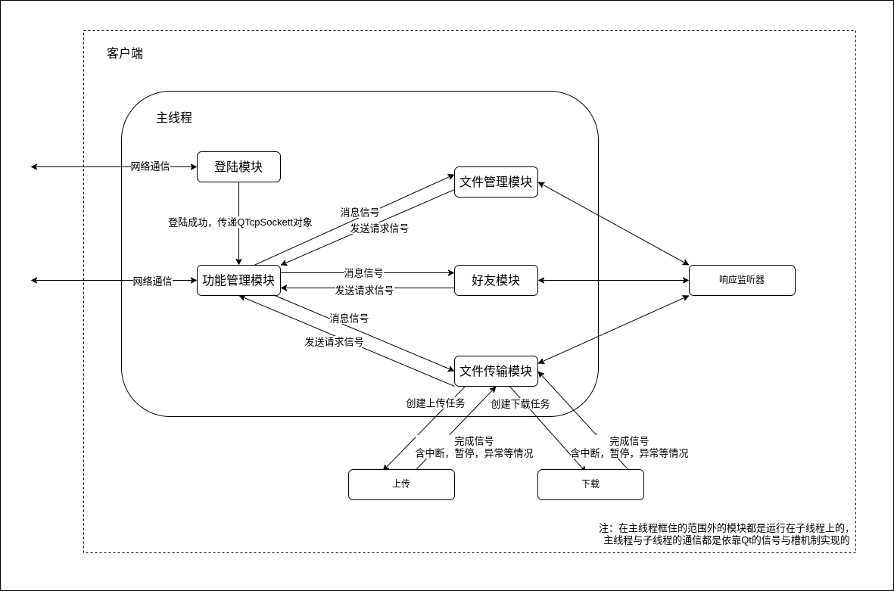

# Netdisk Client

## 框架

## 运行环境
* 操作系统：Ubuntu 22.04.4 LTS
* 开发工具：Qt Creator
* 依赖库：  
    - Qt 6.2.3 GCC 64bit

## 登陆模块
1. 功能：
    * 主要负责用户的登陆以及主线程socket的连接，在登陆成功后，将socket对象交给功能管理模块管理
2. 相关文件：
    * [login.h](login.h)

## 功能管理模块
1. 主要功能:
    * 负责文件管理、文件传输、好友页面的切换。
    * 接收这几个模块发送请求的信号，然后通过管理的socket将具体请求转发给服务器。
    * 接收服务器响应并将内容解析成一个数据单元，通过信号携带数据单元发出，管理的子模块接收到信号按需接收或忽略，信号携带的数据单元由共享指针管理。
    * 提供设置功能，目前支持设置下载路径。
2. 相关文件：
    * [mainpage.h](mainpage.h)

## 文件管理模块
1. 主要功能：
    * 负责文件的删除，重命名。
    * 负责文件夹的创建、访问、重命名、删除。
    * 提供上传和下载任务的创建。
2. 相关文件：
    * [folderpage.h](folderpage.h)
    * [folderlistitemwidget.h](folderlistitemwidget.h)

## 文件传输模块
1. 主要功能：
    * 负责文件传输的进度展示。
    * 负责文件传输中的取消，暂停，继续操作。
2. 相关文件
    * [transmitpage.h](transmitpage.h)
    * [progressitemwidget.h](progressitemwidget.h)

## 好友模块
1. 主要功能：
    * 提供用户查询以及添加好友功能。
    * 展示好友列表。
    * 好友聊天（未实现）。
2. 相关文件：
    * [friendpage.h](friendpage.h)
    * [friendlistitemwidget.h](friendlistitemwidget.h)
    * [friendapplicationlist.h](friendapplicationlist.h)
    * [addfrienddialog.h](addfrienddialog.h)
    * [alistitemwidget.h](alistitemwidget.h)

## 设置模块
1. 主要功能：
    * 自定义下载路径。
2. 相关文件：
    * [settingdialog.h](settingdialog.h)

## 其它
1. [响应监听器](respondwatcher.h)，监听一个信号，在指定时间内没有触发则显示指定的错误信息，在该程序中主要用于处理响应超时的情况，。
2. [请求生成API](msgtools.h)，提供一组API生成符合规定的通信协议的请求。
3. [气泡消息](bubbletips.h)，用于短暂显示提示信息或错误、异常信息。
4. [状态码解析](statusCode.h)，解析可能接收到的状态码。

[<--](../README.md)