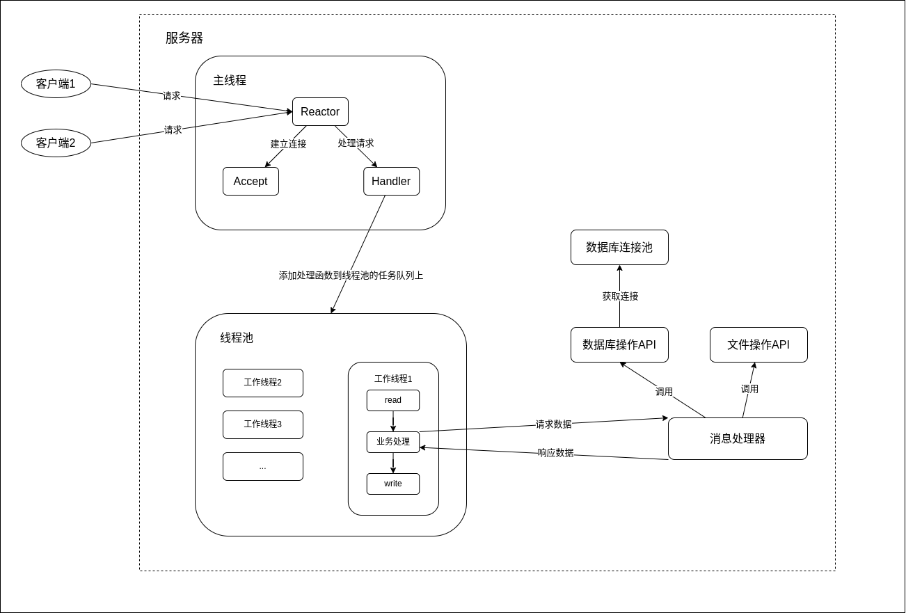

# Netdisk Server

## 目录
* [框架](#框架)
* [JSON库](json/README.md)
* [通信协议](msg/README.md)
* [线程池](threadpool/README.md)
* [数据库连接池](mysql/README.md)
* [数据库操作API](idatabase/README.md)
* [文件/文件夹操作API](ifilefolder/README.md)
* [包裹函数](wrap/README.md)
* [运行环境](#运行环境)

<span id="框架"></span>
## 框架


<span id="运行环境"></span>
## 运行环境
* 操作系统：Ubuntu 22.04.4 LTS
* 开发工具：Visual Studio Code
* 依赖库：  
    - libevent 2.1.12-stable
    - libmysqlclient-dev 8.0.37-0ubuntu0.22.04.3
* docker
    ```shell
    docker pull ghcr.io/fhwhsa/netdisk/netdiskserverenv:latest
    ```
    * 项目路径：`/opt/netdisk/server`
    * 注意事项：
        * 数据库
            * 启动：`service mysql start`
            * 用户名及密码：root，123456
        * 数据库用户信息为空

[<--](../README.md)